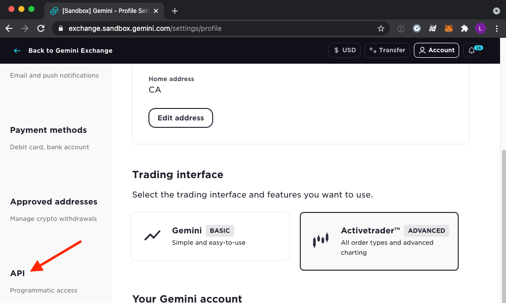
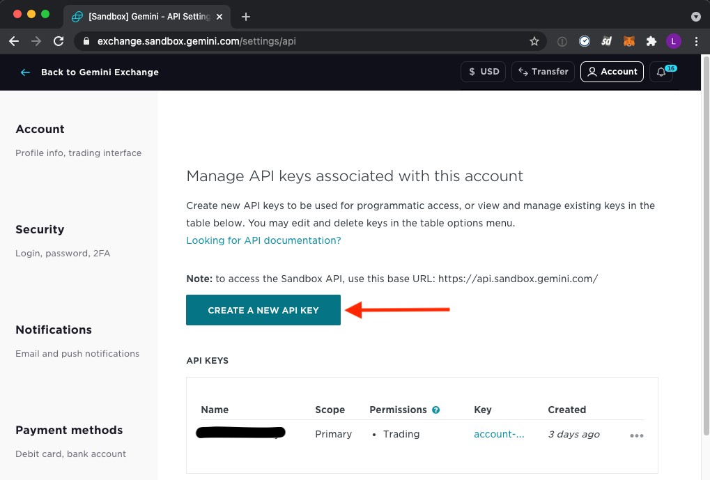
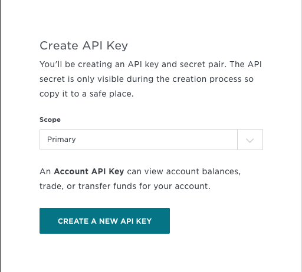
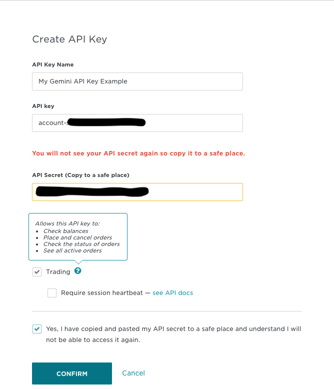

Simple script to leverage Gemini's API to place orders at a [lower fee](https://www.gemini.com/fees/api-fee-schedule#section-api-fee-schedule) (0.350% taker fee, 0.100% maker fee currently), mainly for the purpose of automating dollar-cost-averaging (DCA) on using AWS Lambda.

I will not go into the details of getting this function running on AWS and how to set up DCA.

# AWS

This script assumes AWS Lambda as runtime (but you can [run it locally](#running-locally)) but also fetches the API Secret stored as `SecureString` in [AWS Systems Manager Parameter Store](https://docs.aws.amazon.com/systems-manager/latest/userguide/systems-manager-parameter-store.html).

Alternatively you can just change the script and pass in your key and secret in a different way.

The function takes the following inputs from the event:
* `account`: API Key without the `account-` prefix, e.g. `123456789` if Gemini generated the API Key `account-123456789`
* `symbol`: The [symbol](https://docs.gemini.com/rest-api/?python#symbols-and-minimums) for the order you want to place, I have only tested with `BTCUSD` and `ETHUSD`
* `fiatAmount`: The amount of USD (assuming your base currency is USD) you want to spend
* `orderType` (optional): `taker` (default) or `maker`. **Note:** maker orders might not get filled so you might have to watch your order logs

# Gemini API Setup

To use this script, you'll need to set up an API Key with Gemini. I'd suggest playing with the [Sandbox](https://exchange.sandbox.gemini.com/) first before trying it on your main account.

But the important thing to know is that you only need a `Trading` scope for the API Key, which allows the following things:
* Check balances
* Place and cancel orders
* Check the status of orders
* See all active orders

So with a `Trading` API Key, it is not possible to move funds to another account if your API Secret was compromised. The main thing that could happen is that your balances on Gemini could be checked or orders could be placed or cancelled, but at least nothing could be stolen. So it's not that bad BUT **make sure your API Secret is secure**! This is the reason why I'm using Parameter Store.

To create the API Key, go to your profile and click `API`:



Then click `CREATE A NEW API KEY`:



Select `Primary` and click `CREATE A NEW API KEY`:



Optionally set your own name, select `Trading` as scope, copy your API Secret (ideally also your API Key) in a secure place, click the last checkbox to acknowledge that you copied it and hit `CONFIRM`:



You've successfully created your API Key, you're now ready to go!


# Running locally

You can also run the script locally by passing a few environment variables:
* `LOCAL`: Set this to `true` if you're running locally
* `ACCOUNT`: API Key without the `account-` prefix, e.g. `123456789` if Gemini generated the API Key `account-123456789`
* `SYMBOL`: The [symbol](https://docs.gemini.com/rest-api/?python#symbols-and-minimums) for the order you want to place, I have only tested with `BTCUSD` and `ETHUSD`
* `FIAT_AMOUNT`: The amount of USD (assuming your base currency is USD) you want to spend
* `ORDER_TYPE` (optional): `taker` (default) or `maker`. **Note:** maker orders might not get filled so you might have to watch your order logs
* `SANDBOX` (optional): Set to `true` to run this script against the Gemini [Sandbox](https://exchange.sandbox.gemini.com/), i.e. a testing account (that you need to sign up for) rather than a real account
* `AWS_PROFILE` (optional): Set to the name of your alternative AWS profile defined in `~/.aws/credentials` if you're not using the default profile

So running locally would be something like:
```
SANDBOX=true ACCOUNT=123456789 LOCAL=true FIAT_AMOUNT=10 SYMBOL=BTCUSD ORDER_TYPE=taker node index.js
```